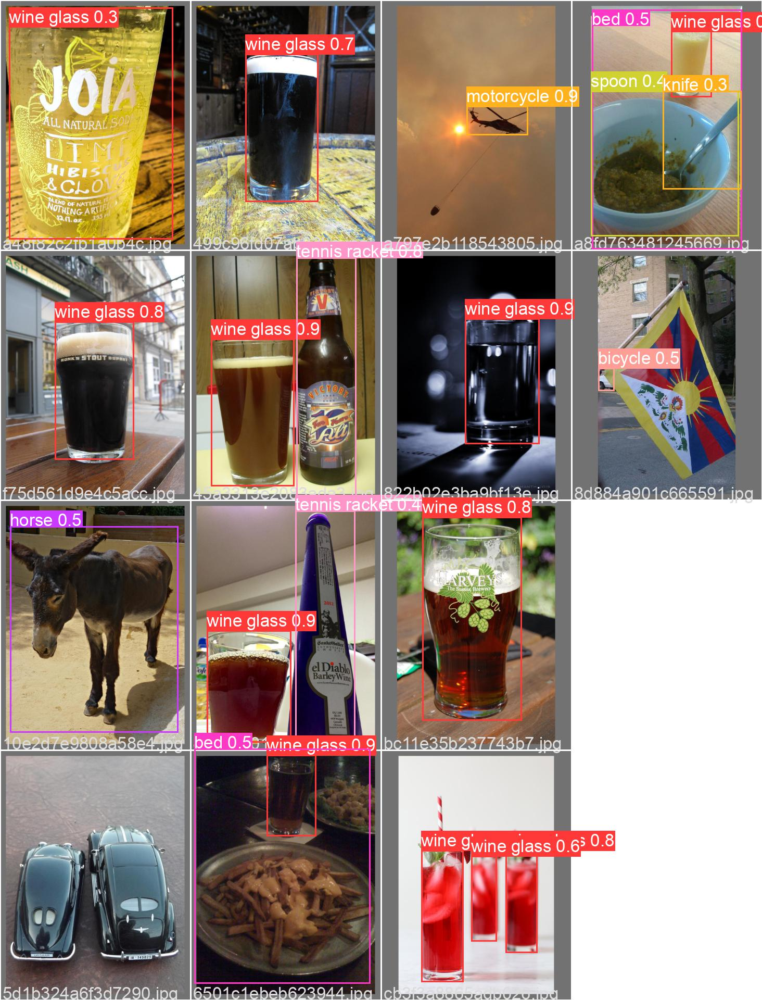

# YOLO v5 Object Detection

This is just an attempt to look at results that get YOLOv5 on a difficult object detection dataset.
I used only 10 epochs without data augmentations because it requires a lot of time. And I trained it on CPU because it requires a lot of memory.


I didn't create a network from scratch and used YOLOv5 from Ultralytics https://github.com/ultralytics/yolov5
My work here is file prepare_data.py for preparing training data, creating config.yaml, and some changes in python code from Ultralytics.

After 10 epochs I got the following results:


epoch|val/box_loss|val/obj_loss|val/cls_loss|metrics/precision|metrics/recall|metrics/mAP_0.5|metrics/mAP_0.5:0.95
:----|:----------:|:----------:|:----------:|:---------------:|:------------:|:-------------:|:-------------------
0    |0.028177    |0.012816    |0.07159     |0.17342          |0.30093       |0.18698        |0.13435
1    |0.030462    |0.012195    |0.044993    |0.71658          |0.25278       |0.28394        |0.21142
2    |0.034948    |0.012052    |0.038074    |0.53566          |0.36631       |0.32028        |0.22105
3    |0.033892    |0.012206    |0.034589    |0.68611          |0.3369        |0.35145        |0.247
4    |0.032069    |0.012463    |0.032475    |0.60565          |0.38624       |0.37782        |0.26749
5    |0.032015    |0.011978    |0.032568    |0.76629          |0.32946       |0.37904        |0.27986
6    |0.032053    |0.011441    |0.033401    |0.78342          |0.35536       |0.45739        |0.32972
7    |0.031698    |0.011893    |0.030709    |0.72448          |0.37125       |0.44002        |0.31807
8    |0.029087    |0.011707    |0.028872    |0.71921          |0.35416       |0.43726        |0.33029
9    |0.028467    |0.011615    |0.029585    |0.74997          |0.36469       |0.46072        |0.36282

Here are some not very outstanding results:





To run the code I used the following commands in the terminal:

```
 python prepare_data.py
 ```

and then

```
python train.py --img 640 --cfg yolov5s.yaml --hyp hyp.scratch.yaml --batch 32 --epochs 10 --data config.yaml --weights yolov5s.pt --workers 24 --name yolo_name
```
